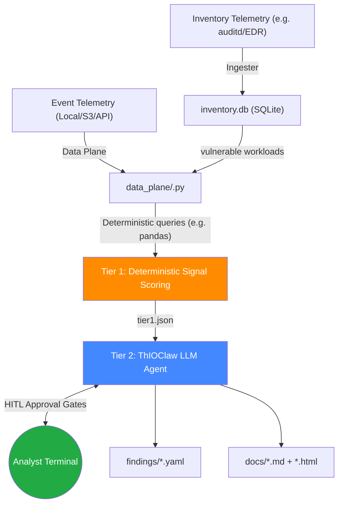

# ThIOClaw — Vulnerability Investigation Harness

> An engineering-first, local-first harness for **transparent, repeatable, and version-controlled** LLM-powered vulnerability investigation. Built for security teams who refuse to accept black-box AI verdicts.

---

## Why ThIOClaw?

LLMs are being embedded into detection & response workflows at an accelerating pace — but most teams adopt them as **opaque black boxes**. You can't inspect the reasoning, reproduce a verdict, version-control the logic, or evaluate whether the agent actually improved your security posture.

ThIOClaw is built on five engineering principles:

| Principle | How ThIOClaw Delivers |
|---|---|
| **Transparency** | Every LLM tool call, evidence lookup, and verdict is logged in structured JSONL and OpenTelemetry spans. Full reconstruction of any investigation. |
| **Repeatability** | Tier 1 signal scoring is **deterministic** pandas math — same input, same output, every time. The LLM reasons *on top of* reproducible foundations. |
| **Configurability** | Signal rules, weights, verdict thresholds, and exploit chain descriptions are YAML files. The agent's prompt and tools are Python source code. No hidden dashboards. |
| **Version Control** | Detection logic, agent behavior, and signal rules all live in Git. Changes produce clean diffs. Review, approve, and roll back with standard engineering workflows. |
| **Measurability** | Run the same investigation with different models, prompts, or tool configs. Compare Tier 1 baselines against Tier 2 LLM verdicts. Prometheus metrics track agent performance over time. |

**This project is for security teams who want engineering control and observability into their journey into LLM-powered SecOps.**

---

## macOS Setup & Quick Start

### 1. Setup the Environment

```bash
git clone https://github.com/tej-nik/ThIOClaw.git
cd ThIOClaw
python3 -m venv .venv
source .venv/bin/activate
pip install -r requirements.txt
```

### 2. Configure the LLM (Local or Cloud)

ThIOClaw uses [LiteLLM](https://github.com/BerriAI/litellm) for its control plane, meaning you can plug in **any** LLM provider (Ollama, Anthropic, OpenAI, AWS Bedrock, etc.) without changing code.

#### Option A: Local (Ollama)
For complete privacy, run the LLM locally on your Mac:
```bash
ollama serve                    # Start the server
ollama pull llama3.1:8b         # Pull the default model
```

#### Option B: Direct cloud (Anthropic / OpenAI)
Export your provider's API key and set the model via `THIOCLAW_MODEL`:

```bash
# Anthropic Claude 3.5 Sonnet
export ANTHROPIC_API_KEY="sk-ant-..."
export THIOCLAW_MODEL="claude-3-5-sonnet-20241022"

# OpenAI GPT-4o
export OPENAI_API_KEY="sk-proj-..."
export THIOCLAW_MODEL="gpt-4o"
```

#### Option C: AWS Bedrock
Auth uses the boto3 default credential chain (env vars, `~/.aws/credentials` profile, or IAM role). Region must be set explicitly:

```bash
export AWS_REGION_NAME="us-east-1"
export AWS_PROFILE="default"          # or rely on env-var credentials
export THIOCLAW_MODEL="bedrock/anthropic.claude-3-5-sonnet-20241022-v2:0"
```

#### Option D: Google Vertex AI
Works for both Claude on Vertex and Gemini. Requires a service-account key file:

```bash
export VERTEXAI_PROJECT="your-gcp-project"
export VERTEXAI_LOCATION="us-central1"
export GOOGLE_APPLICATION_CREDENTIALS="/abs/path/to/service-account.json"
export THIOCLAW_MODEL="vertex_ai/gemini-1.5-pro"
# or: export THIOCLAW_MODEL="vertex_ai/claude-3-5-sonnet@20240620"
```

> Provider plumbing lives in [`scripts/thioclaw_agent/providers.py`](scripts/thioclaw_agent/providers.py). To add a new provider, register a `ProviderResolution` factory there. See [`.env.example`](.env.example) for the full set of supported environment variables.

#### Selecting the agent framework

ThIOClaw ships two parallel implementations of the Tier 2 agent loop, selectable per run:

```bash
# Raw LiteLLM tool-calling loop (default)
export THIOCLAW_FRAMEWORK=litellm-direct

# Strands SDK loop (AgentCore-native, multi-agent primitives, MCP support)
export THIOCLAW_FRAMEWORK=strands
```

Both implementations share the same provider routing and verdict contract. The `framework` axis in `openclaw-bench/models.yaml` lets you compare them side-by-side per model.

### 3. Run an Investigation

```bash
# Single investigation cycle using local sample data
python -m harness.orchestrator --raw-telemetry local --once

# Investigate a specific CVE
python -m harness.orchestrator --cve CVE-2026-31431 --once

# Continuous monitoring loop (default: every 300s)
python -m harness.orchestrator --raw-telemetry local
```

### 4. What to Expect

During execution, the agent may pause and ask for your approval:

```
[ThIOClaw Agent] Proposing Query Execution:
Rationale: The existing Q6 staging query missed /var/tmp paths...
Performance Impact: Medium — scanning ~50,000 file events
Query: SELECT * FROM file_events WHERE path LIKE '/var/tmp/%'

Approve execution? (y/N): _
```

This is the **Human-In-The-Loop (HITL)** gate — the agent articulates *why* it needs the query and *what the cost is*, and you decide whether to approve.

---

## Telemetry Sources

Two orthogonal axes determine where telemetry comes from and how it's shaped:

**1. Data location** (`--raw-telemetry`) — where the harness reads events from:

| Flag | Source | Credentials |
|---|---|---|
| `--raw-telemetry local` | `data/events.json` | None |
| `--raw-telemetry s3` | S3 bucket via `data/s3_manifest.json` | `~/.aws/credentials` named profile |

**2. Collector format** (`telemetry.event_source` in `harness.yaml`) — what event-stream format the harness ingests:

| Value | Collector | Notes |
|---|---|---|
| `osquery` (default) | osquery `process_events`, `socket_events`, `kernel_module_events`, `file_events`, etc. | Bundled sample data (`data/sample_events.json`) ships in this format. All six Q1-Q6 reference queries target it. |
| `auditd` | Linux kernel auditd via `auditctl` rules + `ausearch`/`auparse` | Mirror coverage via SigmaHQ rules at [`rules-emerging-threats/2026/Exploits/CVE-2026-31431/`](https://github.com/SigmaHQ/sigma/pull/6052). Validation runbook: [`runbooks/CVE-2026-31431_sigma_validation.md`](runbooks/CVE-2026-31431_sigma_validation.md). |
| `both` | Union of the two | For environments running both collectors. The data plane is source-agnostic — it scores whatever DataFrame is fed in. |

Per-signal source support is declared in `signals/<CVE-ID>.yaml` via `supported_sources:` on each rule.

### S3 Setup

1. Edit `data/s3_manifest.json` with your bucket, region, and key paths
2. Configure your `~/.aws/credentials` with the named profile
3. Set `aws.profile_name` in `harness.yaml` if using a non-default profile

---

## Project Structure

```
ThIOClaw/
├── CLAUDE.md                          # Comprehensive project guide & design rationale
├── README.md                          # This file
├── harness.yaml                       # Main harness configuration
├── targets.yaml                       # CVE investigation targets
├── requirements.txt                   # Python dependencies
│
├── data_plane/                        # DATA PLANE — Modular investigation scripts
│   └── cve_2026_31431.py              #   Deterministic pandas analysis (Q1–Q6)
│
├── scripts/                           # CONTROL PLANE — LLM Agent
│   ├── thioclaw.py                    #   CLI entry point
│   └── thioclaw_agent/
│       ├── agent.py                   #   Agentic loop (Ollama + tool calling + HITL)
│       ├── prompts.py                 #   System prompt
│       └── tools.py                   #   Tool definitions + implementations
│
├── signals/                           # Signal rule definitions (YAML)
│   └── CVE-2026-31431.yaml            #   Rules, weights, verdict logic, LLM context
│
├── queries/                           # Reference Detection Queries (e.g., SQL, KQL)
│   └── CVE-2026-31431/               #   Example query files
│
├── harness/                           # Orchestrator engine
│   ├── orchestrator.py                #   CLI + run loop + concurrent dispatch
│   ├── config.py                      #   Typed dataclasses from YAML
│   └── ingester.py                    #   CSV → SQLite inventory ingestion
│
├── observability/                     # Instrumentation
│   ├── logger.py                      #   Thread-safe structured JSONL logger
│   ├── metrics.py                     #   Prometheus metrics via OpenTelemetry
│   └── traces.py                      #   OTel distributed tracing
│
├── data/                              # Sample data (replace with real telemetry)
│   ├── sample_events.json             #   9 events simulating a full exploit chain
│   ├── sample_inventory.csv           #   8 workloads with mixed statuses
│   └── s3_manifest.json               #   S3 config template (no secrets)
│
├── findings/                          # Output: YAML findings + JSONL log (gitignored)
├── docs/                              # Output: per-run Markdown + HTML reports
├── logs/                              # Output: Structured JSONL logs (gitignored)
└── tests/                             # Unit tests (pytest)
```

---

## Architecture



### How It Works

1. **Ingest** — Host inventory telemetry is loaded into SQLite. Workloads matching `trigger_assessments` (e.g., `vulnerable_or_not_confirmed_fixed`) are selected for investigation.
2. **Tier 1 (Data Plane)** — A modular Python script runs deterministic queries against raw telemetry events. Each query checks for a specific exploitation indicator. Signals are scored using configurable weights to produce a deterministic verdict: `exploited`, `suspicious`, `benign`, or `inconclusive`.
3. **Tier 2 (Control Plane)** — The ThIOClaw LLM agent receives the Tier 1 results and the CVE's theoretical exploit chain. It correlates evidence, requests deeper telemetry inspection, and can propose new queries — but must get **analyst approval** via the terminal before executing them.
4. **Output** — Findings are persisted as YAML, Markdown, and HTML per run. All events are instrumented with OpenTelemetry.

---
## Bundled Example: CVE-2026-31431

ThIOClaw ships with a complete investigation for **CVE-2026-31431** (Linux kernel `algif_aead` local privilege escalation) including sample telemetry that simulates a full exploit chain.

| Query | Signal | Weight | Tier |
|---|---|---|---|
| Q1 | `algif_aead` module loaded in inventory | 0.3 | Suspicious |
| Q2 | Unprivileged `AF_ALG` socket opens | 0.5 | Suspicious |
| Q3 | UID escalation after `AF_ALG` open **(primary)** | 1.0 | **Exploited** |
| Q4 | Root shell from non-root parent | 0.9 | **Exploited** |
| Q5 | `algif_aead` module load events | 0.4 | Suspicious |
| Q6 | Exploit staging in `/tmp`, `/dev/shm`, memfd | 0.6 | Suspicious |

**Verdict logic:** `exploited` if any exploited-tier signal fires AND total weight ≥ 1.0. `suspicious` if total ≥ 0.5. `benign` if total = 0. `inconclusive` otherwise.

**Auditd-shaped coverage** — the same exploit chain is also covered by three SigmaHQ rules contributed in [SigmaHQ/sigma#6052](https://github.com/SigmaHQ/sigma/pull/6052) (AF_ALG socket creation, `algif_aead` module load, splice on setuid path). Reproduce and validate against live audit telemetry with [`runbooks/CVE-2026-31431_sigma_validation.md`](runbooks/CVE-2026-31431_sigma_validation.md).

---

## Observability

| Layer | Implementation | Endpoint / Location |
|---|---|---|
| Structured logs | Thread-safe JSONL writer | `logs/agent_runs.jsonl` |
| Metrics | OpenTelemetry → Prometheus | `http://localhost:9090/metrics` |
| Traces | OpenTelemetry spans | stdout (default) or OTLP gRPC endpoint |

---

## Investigating Any Vulnerability

ThIOClaw is designed to be **generic**. Add a new CVE target in three steps:

1. **Define the target** — Add an entry to `targets.yaml` with the CVE-ID, data plane script module path, and signals file.
2. **Configure signals** — Create `signals/<CVE-ID>.yaml` with weighted rules and an `agent_context` block describing the exploit chain for the LLM.
3. **Write the data plane** — Create `data_plane/<cve_id>.py` implementing the `run_investigation()` function with pandas queries specific to the vulnerability's telemetry fingerprint.

See [CLAUDE.md](CLAUDE.md) for detailed instructions and design rationale.

---

## Running Tests

```bash
pytest tests/ -v
pytest tests/ -v --cov=harness --cov=observability --cov-report=term-missing
```

---

## License

See [LICENSE](LICENSE) for details.
