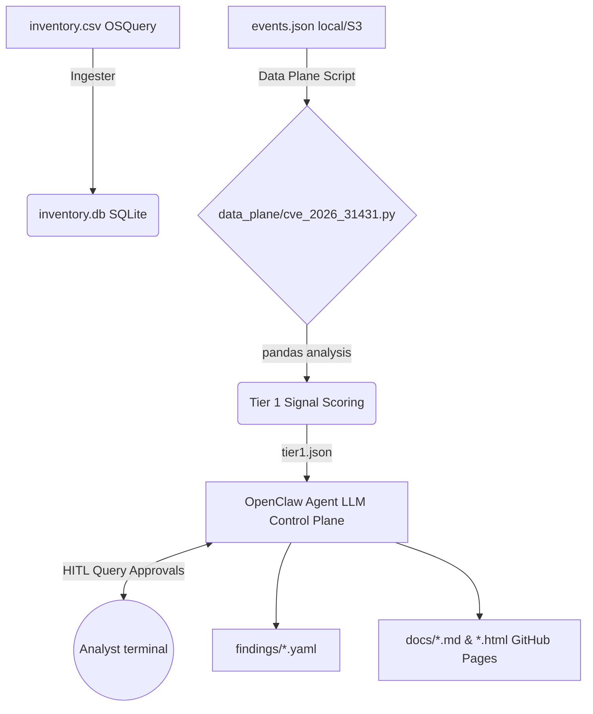

# ThIOClaw — OpenClaw Vulnerability Investigation Harness

> A local-first, engineering-grade harness built around the **OpenClaw** agent that monitors workload inventory (OSQuery-derived), matches assets to vulnerability signatures, and investigates real-time telemetry events to determine whether a vulnerability was actively exploited.

[](https://tej-nik.github.io/ThIOClaw)

---

## Architecture



## macOS Setup & Quick Start

To evaluate OpenClaw locally on macOS, you can use the bundled agent scripts.

### 1. Setup the Environment

Create your virtual environment and install dependencies:

```bash
cd ThIOClaw
python3 -m venv .venv
source .venv/bin/activate
pip install -r requirements.txt
```

### 2. Configure API Keys & Ollama

The OpenClaw agent uses an LLM for its control plane. By default, it expects a local **Ollama** instance to be running for private, free, on-device inference.

1. [Download Ollama](https://ollama.com) and install it on your Mac.
2. Start the server and pull the recommended model (requires ~16GB Unified Memory):
   ```bash
   ollama serve
   ollama pull llama3.1:8b
   ```
3. *(Optional)* To test different models, you can set the environment variable:
   ```bash
   export OLLAMA_MODEL="qwen2.5:7b"
   ```

### 3. Run the Evaluation Harness

You can now run the orchestrator. The modular Python Data Plane will run deterministic pandas queries, score Tier-1 signals, and then invoke the local `scripts/openclaw.py` agent. 

**Human-In-The-Loop (HITL):** During execution, the agent may use its `propose_query_execution` tool if it feels the evidence is lacking. You will be prompted in the terminal to review its rationale, performance impact, and approve the execution!

```bash
# Single cycle, local telemetry
python -m harness.orchestrator --raw-telemetry local --once

# Continuous loop, local telemetry
python -m harness.orchestrator --raw-telemetry local

# Investigate a specific CVE
python -m harness.orchestrator --cve CVE-2026-31431 --once
```

---

## `--raw-telemetry` Flag

| Value | Source | Credentials |
|---|---|---|
| `local` | `data/events.json` | None |
| `s3` | S3 bucket via `data/s3_manifest.json` | `~/.aws/credentials` named profile |

### S3 Setup

1. Edit `data/s3_manifest.json` with your bucket/key paths
2. Ensure your `~/.aws/credentials` has the profile:
   ```ini
   [default]
   aws_access_key_id = AKIA...
   aws_secret_access_key = ...
   ```
3. Set `aws.profile_name` in `harness.yaml` if using a non-default profile

---

## Project Structure

```
ThIOClaw/
├── harness.yaml                   # Main config
├── targets.yaml                   # CVE investigation targets
├── signals/<CVE-ID>.yaml          # Signal rules + weights (e.g. CVE-2026-31431)
├── queries/<CVE-ID>/              # Reference OSQuery SQL files
├── data_plane/
│   └── cve_2026_31431.py          # Modular Python Data Plane execution script
├── data/
│   ├── sample_inventory.csv       # Sample data (replace with real)
│   ├── sample_events.json         # Sample telemetry (replace with real)
│   └── s3_manifest.json           # S3 config (no secrets)
├── harness/                       # Python orchestrator modules
├── observability/                 # OTel metrics, traces, structured logging
├── findings/                      # Output YAML findings (gitignored)
├── docs/                          # GitHub Pages HTML/MD output
├── logs/                          # Structured JSONL logs (gitignored)
└── tests/                         # Unit tests
```

---

## Example: CVE-2026-31431

ThIOClaw comes with a bundled example for **CVE-2026-31431** to demonstrate the harness's capabilities. The queries used in this example are:

| Query | Signal | Tier |
|---|---|---|
| Q1 | `algif_aead` module loaded? | Inventory |
| Q2 | Unprivileged `AF_ALG` socket opens | Suspicious |
| Q3 | UID escalation after `AF_ALG` open (**primary**) | **Exploited** |
| Q4 | Root shell from non-root parent | **Exploited** |
| Q5 | `algif_aead` module load events | Suspicious |
| Q6 | Exploit staging in `/tmp`, `/dev/shm`, memfd | Suspicious |

---

## Investigating Any Vulnerability

ThIOClaw is designed to be highly generic. You can investigate **any** vulnerability by supplying the necessary signals, queries, and data plane script:

1. **Define Target**: Add an entry to `targets.yaml` with the CVE-ID.
2. **Configure Signals**: Create `signals/<CVE-ID>.yaml` defining the conditions and weights.
3. **Build Data Plane**: Duplicate `data_plane/cve_2026_31431.py`, rename it, and adapt the pandas analysis logic for the new vulnerability.
